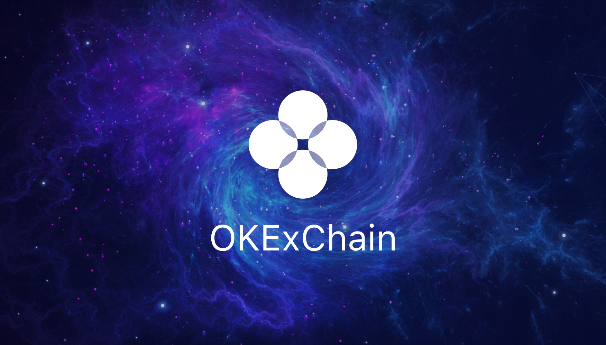

# OMExChain
The Infrastructure of Decentralized Exchange



[](https://github.com/omexapp/omexchain/releases/latest)
[](https://circleci.com/gh/omexapp/omexchain/tree/master)
[](https://codecov.io/gh/omexapp/omexchain)
[](https://goreportcard.com/report/github.com/omexapp/omexchain)
[](https://github.com/omexapp/omexchain/blob/master/LICENSE)
[](https://github.com/omexapp/omexchain)
[](https://golangci.com/r/github.com/omexapp/omexchain)

This repository hosts `OMExChain`, the implementation of the OMExChain based on the [Cosmos SDK](https://github.com/cosmos/cosmos-sdk).

**Note**: Requires [Go 1.14](https://golang.org/dl/)

## Getting Started
See the [documentation](https://omexchain-docs.readthedocs.io/en/latest/index.html).

## OMExChain Testnet

To run a full-node for the testnet of the OMExChain, first [install `omexchaind`](https://omexchain-docs.readthedocs.io/en/latest/getting-start/install-omexchain.html), then follow [the guide](https://omexchain-docs.readthedocs.io/en/latest/getting-start/join-omexchain-testnet.html).

For status updates and genesis file, see the [genesis](https://omexchain-docs.readthedocs.io/en/latest/getting-start/join-omexchain-testnet.html#genesis-seeds).

## Quick Start

```
make install
```


